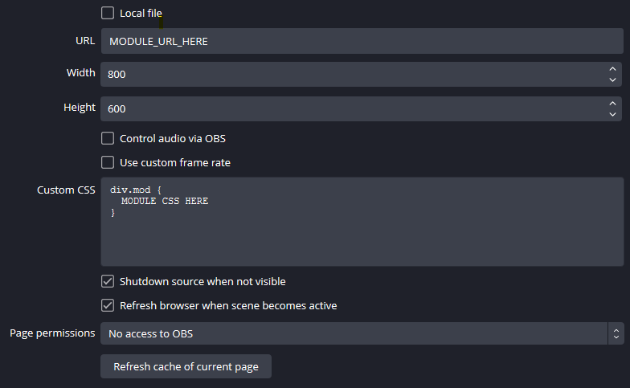

# Olay-toucotop

This is a fork of <https://github.com/etrusci-org>, personnalised for [Toucotop's channel](https://www.twitch.tv/toucotop_)

Live stream overlay stuff for use as Browser-Source in [OBS Studio](https://github.com/obsproject/obs-studio).

---

## Modules

I am in the process of customizing the modules

### Customized

- [chat](./app/mod/chat/README.md)

### In progress

- [clock](./app/mod/clock/README.md)
- [colorfader](./app/mod/colorfader/README.md)
- [goal](./app/mod/goal/README.md)
- [numbers](./app/mod/numbers/README.md)
- [quotes](./app/mod/quotes/README.md)
- [rotator](./app/mod/rotator/README.md)

---

## Hosting

I host the current [main branch](https://github.com/SThor/olay-toucotop/tree/toucotop), which is most likely ahead of the latest release.  
Access it at: <http://vps-fedac591.vps.ovh.net>

You can also clone this repo or download a specific [release](https://github.com/SThor/olay-toucotop/releases) and put it on your own webserver.

---

## Output Styling

All modules will output their content inside a `<div>` with the class `mod`. Some modules may introduce sub-elements (see module documentation), but in general it's enough to style `.mod` like so:

```css
.mod {
    font-family: sans-serif;
    font-size: 42px;
    color: #009900;
}
```

For specific CSS selectors, see the individual README's of the modules.

Global default style: [app/lib/default.css](./app/lib/default.css)  
For help with CSS see:

- [CSS For Starters](./CSS.md)
- [Full CSS Reference](https://developer.mozilla.org/docs/Web/CSS)

---

## Browser-Source Settings



- **URL**: Module URL goes here
- **Width**: Maximum module output width in pixels
- **Height**: Maximum module output height in pixels
- **Control audio via OBS**: Leave unchecked
- **Use custom frame rate**: Leave unchecked
- **Custom CSS**: Custom module CSS styles go here
- **Shutdown source when not visible**: Read below
- **Refresh browser when scene becomes active**: Read below
- **Page permissions**: Set to "No access to OBS"

You must decide per use-case if you want to have both **Shutdown source when not visible** and **Refresh browser when scene becomes active** checked. For example, if you use a number counter, it'll reset when whenever the overlay becomes invisible because of a scene switch or similar actions in OBS. Also, any queue will be reset too, for example in the quotes module, and therefore you'll see more duplicates when switching scenes often. Basically, if you leave both unchecked, the module will run in the background even if it is not visible.

---

## Notes

- If you're unsure, test the module URL in a webbrowser and not OBS directly. This way you can quickly edit the URL parameters or add `&debug=true` to see the current module configuration.
- To install it on your own webserver, just copy the contents of the **olay/app/** directory.
- If you install it on your own webserver and edit the module configurations, always enter values as *strings*. E.g. enclose in single-quotes (') or backticks (`).
- It won't run if not loaded from a webserver. E.g. just loading it from your local filesystem won't work because of [CORS](https://en.wikipedia.org/wiki/Cross-origin_resource_sharing).

---
